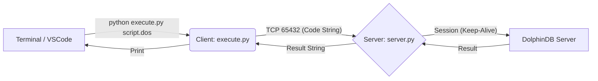

# DolphinDB 执行器 (Script Analysis & Persistence)

本技能包提供了一套基于 Python 的 DolphinDB 执行环境，核心特色是支持 **持久化会话 (Persistent Session)**。这意味着你可以像在 GUI 客户端中一样，分步骤执行代码，变量和函数定义会保留在内存中。

## 🏗️ 核心架构

本工具采用 **Client-Server** 模式来解决“脚本执行完即销毁”的问题。



### 为什么需要 `server.py`?
普通的 `python execute.py` 每次运行都会创建一个新的连接，执行完脚本后连接关闭，临时变量（如 `t = table(...)`）随之消失。
**`server.py`** 启动后会建立一个长连接，并一直持有该会话。所有发送给它的代码都在**同一个会话**中执行。

---

## 🚀 快速上手 Guide

### 1. 环境准备
本工具支持使用 `uv` 极简执行（脚本内已包含依赖声明，无需手动安装包）。
如果你没有安装 `uv`，请先安装：`pip install uv`。

修改 `scripts/ddb_runner/.env` ，确保包含正确的数据库连接信息：
```ini
DDB_HOST=ip_address
DDB_PORT=port
DDB_USER=admin
DDB_PASSWORD=123456
```

### 2. 执行脚本 (Client)
在主工作终端中，使用 `uv run` 发送代码（默认每次执行创建新会话）：

**方式 A: 执行文件 (.dos)**
```powershell
uv run scripts/ddb_runner/execute.py scripts/my_script.dos
```

**方式 B: 执行代码片段**
```powershell
uv run scripts/ddb_runner/execute.py -c "x = 1..100; y = x * 2; avg(y)"
```

### 3. 使用持久化会话 (Server)
如果你想保留变量和上下文，需要先启动 Server，然后使用 `--use-server` 参数：

**步骤 1: 启动服务端**
在单独的终端中运行：
```powershell
# 启动服务端（建议挂在后台或单独的 Terminal tab）
uv run scripts/ddb_runner/server.py
```
> **成功标志**: 看到 `Server listening on 127.0.0.1:65432`。此时它已连接到 DDB 并准备就绪。

**步骤 2: 使用 `--use-server` 执行**
```powershell
# 定义一个变量
uv run scripts/ddb_runner/execute.py -c "x = 1..100; y = x * 2;" --use-server

# 在下一次执行中调用该变量（因为 Session 是持久的）
uv run scripts/ddb_runner/execute.py -c "avg(y)" --use-server
# 输出: 101
```

---

## ⚠️ 常见问题与 AI 经验总结 (Pitfalls)

在使用 AI 辅助编程或通过脚本自动化执行时，我们总结了以下**高频错误模式**，请务必注意：

### 1. 脚本执行结果为空 (Empty Return)
*   **现象**: 运行 `execute.py` 后显示 `Success` 但没有内容输出，或者返回 `None`。
*   **原因**: 
    1.  DolphinDB 脚本的最后一行是赋值语句（如 `x = 1`），或 `void` 函数调用，默认不返回结果。
    2.  `print()` 函数在 server 端执行，输出可能流向了 server 的 log (dolphindb.log)，而不是通过 API 返回给 Python client。
*   **解决方案**: 
    *   **显式返回**: 在脚本最后一行单独写上通过想要查看的变量名（例如最后一行写 `resultTable`）。
    *   **尽量少用 print**: 除非你在调试服务端日志，否则尽量让脚本**返回**对象，由 Python 端打印。

### 2. 长连接断开与变量丢失
*   **现象**: 之前定义的 `function` 或 `table` 找不到了。
*   **原因**: `server.py` 可能因为网络波动或报错重启了。
*   **解决方案**: 如果发现变量丢失，请检查 `server.py`终端是否有错误堆栈。重新运行初始化脚本。

### 3. Socket 通信限制 (Buffer Size)
*   **现象**: 执行非常长（几千行）的脚本时，报错或被截断。
*   **原因**: 目前 `server.py` 的接收缓冲区逻辑较为简单 (4096 bytes chunk)，对于极其巨大的脚本可能存在粘包或截断风险。
*   **解决方案**: 
    *   尽量不要一次性发送 MB 级别的 SQL 脚本。
    *   将大任务拆分为多个 `.dos` 文件，使用 `include` 或分次执行。

### 4. 数据类型陷阱
*   **现象**: 也就是 Python 接收到的数据格式看起来很奇怪（如 Dictionary 变成了 String）。
*   **原因**: `server.py` 为了通用性，使用 `str(result)` 将结果转为字符串发回。这对于查看标量或小表很方便，但对于进一步的数据处理不便。
*   **建议**: 本工具定位为**执行与验证**。如需进行大规模数据拉取与分析（如 Pandas 处理），请直接使用 Python SDK (`import dolphindb`) 编写专门的数据处理脚本，而不是依赖本工具的 shell 输出。

## 📂 文件清单

*   `scripts/ddb_runner/server.py`: 持久化会话服务器（核心）。
*   `scripts/ddb_runner/execute.py`: 客户端命令行入口。
*   `scripts/ddb_runner/.env`: 配置文件（需自行创建/修改）。
